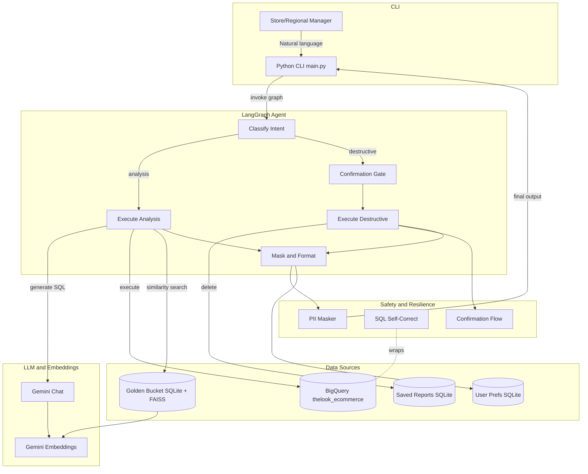

# Retail Data Agent – Architecture

This document describes the high-level architecture of the retail data
analysis agent built on BigQuery and LangGraph.

## High-Level Diagram

## Components

### CLI (`main.py`)
Simple Opsfleet-style interactive loop. Maintains AgentState per session.

### Agent (LangGraph)
- **AgentState**: messages, user_id, pending_destructive_op, last_sql, retry_count, raw_result, final_output
- **Graph nodes**: classify_intent → execute_analysis / confirmation_gate → mask_and_format

### Core Requirements

| Requirement | Module |
|---|---|
| PII Masking | `src/safety/pii_masker.py` — column drop + regex |
| Resilience | `src/resilience/sql_self_correct.py` — LLM rewrite loop |
| High-Stakes Oversight | `src/oversight/confirmation_flow.py` — YES DELETE gate |
| Golden Bucket | `src/memory/golden_bucket.py` — FAISS + SQLite |
| User Preferences | `src/memory/user_prefs.py` — SQLite |
| Persona Management | `src/config/persona.yaml` — editable at runtime |
| Observability | `src/observability/logger.py` — JSON structured logs |
